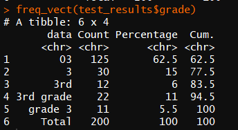
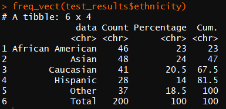
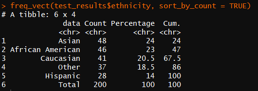
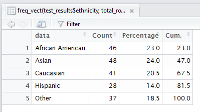
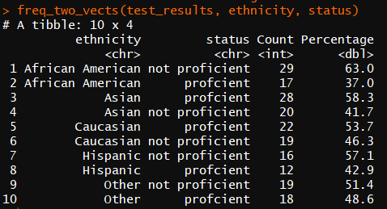
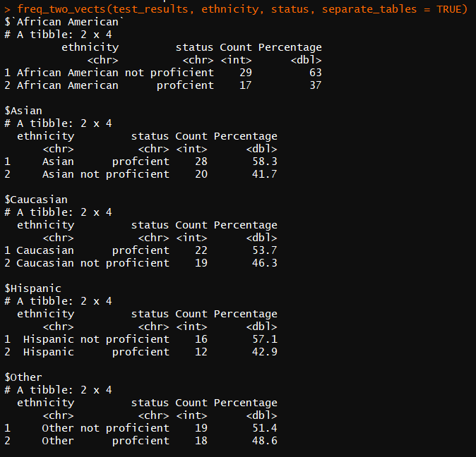
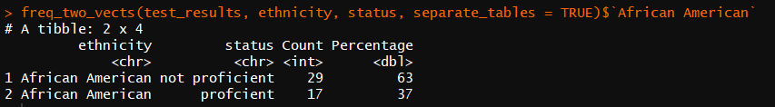

# frequencies 
[](https://travis-ci.org/DataInsightPartners/frequencies)  

Overview
--------  
**frequencies** is an open-source (GPL-3) R package to create frequency tables which display both counts and rates. 
All comments and ideas are welcome. Please submit any bugs to [Issues](https://github.com/DataInsightPartners/frequencies/issues)

Installation
------------
```r
# To install from CRAN
install.packages('frequencies')  

# To install development version
devtools::install_github('DataInsightPartners/frequencies')  
```


freq_vect()
-------------
  
This function is excellent for quickly exploring columns in new data sets. It takes three arguments:  
`freq_vect(data_vector, sort_by_count = FALSE, total_row = TRUE)`

  1. `data_vector` an atomic vector of data
  2.  `sort_by_count` a Boolean value that determines if the output should be sorted by the element name or the element count.  The default is false which sorts the table by the element name.
  3.  `total_row` a Boolean value that determines if the output should have a total summary at the end.  The default is true and the summary row in included.

#### Use Cases
  
Here is code to set up a sample data set to use with `freq_vect`
```r    
set.seed(1)  
test_results <- data.frame(student_id <- 1:200,
                           grade_level <- sample(c(rep('03', 300), 
                                                   rep('3', 50), 
                                                   rep('3rd grade', 50), 
                                                   rep('3rd', 25), 
                                                   rep('grade 3', 25)), 200),
                           ethnicity <- sample(c('African American', 'Asian', 'Caucasian', 
                                                 'Hispanic', 'Other'), 200, replace = TRUE),
                           status <- sample(c('profcient', 'not proficient'), 
                                            200, replace = TRUE))
```
  
The output is helpful at determining the magnitude of how dirty your data is:
```r
freq_vect(test_results$grade)
```



You can quickly review the data by seeing the counts by data element, the percent of the total, and the cumulative percent:
```r
freq_vect(test_results$ethnicity)
```  


You also have the option to sort the data by the count instead of the data element.
```r
freq_vect(test_results$ethnicity, sort_by_count = TRUE)
```



Or remove the total_row and take a look at the data in the data viewer (note that sorting columns in the viewer will not update the cumulative percents).
```r
View(freq_vect(test_results$ethnicity, total_row = FALSE))
```



## freq_two_vects()
This function is excellent for quickly getting a sense of the distribution of a variable within another variable.  In the education context that may be looking at proficiency rates by school, or ethnicity distribution within programs.  


This function takes four arguments:
`freq_two_vects(df, col1, col2, separate_tables = FALSE)`  
  1. `df` a data frame.
  2. `col1` a column from the data frame to be aggregated at the higher level.
  3. `col2` a column from the data frame to be aggregated within col1.
  4. `separate_tables` a boolean value that determines if you wan all aggregations returned in a single data frame or split apart so each element of col1


  
#### Use Cases
  
Here is code to set up a sample data set to use with `freq_vect`
```r    
set.seed(1)  
test_results <- data.frame(student_id = 1:200,
                           grade_level = sample(c(rep('03', 300), 
                                                   rep('3', 50), 
                                                   rep('3rd grade', 50), 
                                                   rep('3rd', 25), 
                                                   rep('grade 3', 25)), 200),
                           ethnicity = sample(c('African American', 'Asian', 'Caucasian', 
                                                 'Hispanic', 'Other'), 200, replace = TRUE),
                           status = sample(c('profcient', 'not proficient'), 
                                            200, replace = TRUE),
                           stringsAsFactors = FALSE)
```

In the sample data we can easily see proficiency rates within ethnicity:
```r
freq_two_vects(test_results, ethnicity, status)
```



You also have the option to see the output as individual tables:
```r
freq_two_vects(test_results, ethnicity, status, separate_tables = TRUE)
```



As you can see you have the ability to look at just a single table by element reference:
```r
freq_two_vects(test_results, ethnicity, status, separate_tables = TRUE)$`African American`
```

